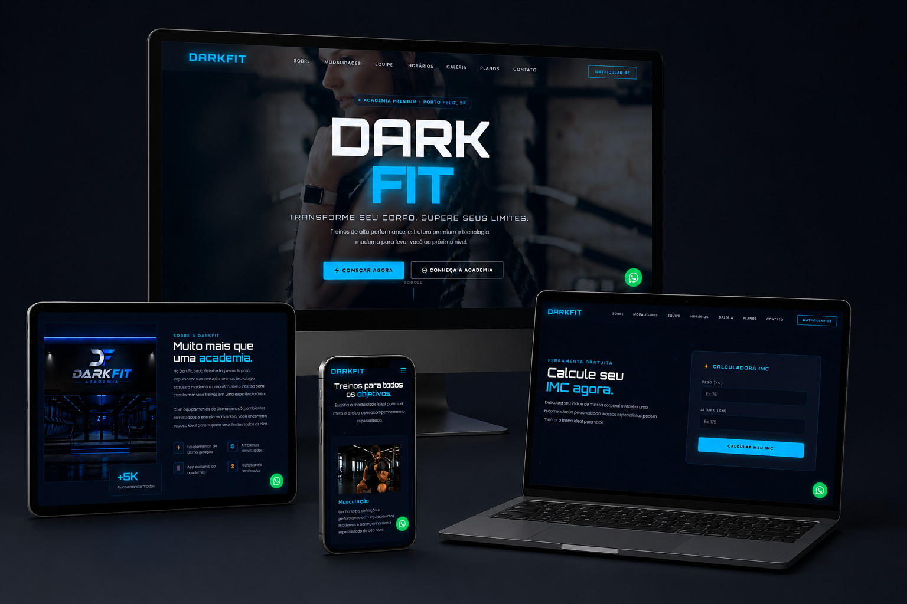

# 🏋️ DarkFit – Transforme seu corpo. Supere seus limites.

Landing page institucional desenvolvida para uma academia premium, com foco em design dark/moderno, performance e experiência do usuário.

🔗 **[Ver projeto ao vivo](https://dark-fit.vercel.app/)**

---

## 📸 Preview



---

## 📋 Sobre o projeto

A **DarkFit** é um projeto de landing page para academia, com visual premium e escuro, desenvolvido com HTML, CSS e JavaScript puro. O objetivo foi criar uma experiência visual de alto impacto, com seções completas que simulam um negócio real de fitness.

---

## ✨ Seções da página

- **Hero** – Chamada principal com CTA e scroll animado
- **Sobre** – Diferenciais e proposta de valor da academia
- **Modalidades** – Musculação, Cardio, Funcional e Personal Training
- **Números** – Contador animado com estatísticas da academia
- **Mentalidade** – Seção de texto animado com ticker horizontal
- **Estrutura** – Galeria de fotos da estrutura física
- **Planos** – Cards com os 3 planos (Starter, Performance e Elite)
- **Depoimentos** – Carrossel infinito com avaliações de alunos
- **Calculadora de IMC** – Ferramenta interativa com classificação personalizada
- **Equipe** – Cards dos profissionais com especialidades
- **Horários** – Tabela de funcionamento por modalidade com filtro por aba
- **Galeria** – Lightbox com imagens da academia em ação
- **Contato** – Formulário integrado com redirecionamento para WhatsApp

---

## 🛠️ Tecnologias utilizadas

- **HTML5**
- **CSS3** – Variáveis CSS, Flexbox, Grid, animações e responsividade
- **JavaScript** – Manipulação do DOM, contadores animados, lightbox, calculadora de IMC, carrossel infinito
- **Google Fonts** – Tipografia moderna
- **WhatsApp API** – Integração via link direto para contato

---

## 📱 Responsividade

O projeto foi desenvolvido com abordagem **mobile-first**, garantindo boa experiência em dispositivos móveis, tablets e desktops.

---

## 🚀 Como visualizar localmente

```bash
# Clone o repositório
git clone https://github.com/danielly-pedrini/dark-fit.git

# Acesse a pasta
cd dark-fit

# Abra o arquivo index.html no navegador
```

Não há dependências ou instalação necessária — basta abrir o `index.html` diretamente no navegador.

---

## 📁 Estrutura de pastas

```
dark-fit/
├── assets/          # Imagens do projeto
├── index.html       # Estrutura da página
├── style.css        # Estilos
└── script.js        # Funcionalidades JavaScript
```

---

## 👩‍💻 Desenvolvido por

**Danielly Pedrini** – Desenvolvedora Web  
[Nelly Tech Solutions]([https://nelly-tech-solutions.vercel.app/]) · [GitHub](https://github.com/danielly-pedrini)

---

> Este é um projeto fictício criado para fins de portfólio. Todos os dados, contatos e depoimentos são meramente ilustrativos.
